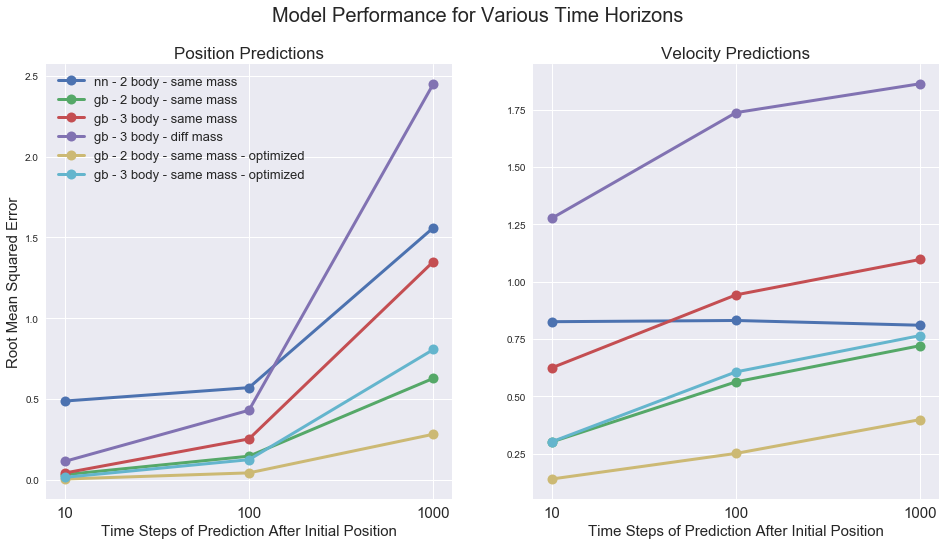

<p align="center">

</p>

# N-Body Can Solve This Problem

<p align="left">

|

</p>

[Eddie Ressegue](http://github.com/redwin21)

The N-Body Problem is an analytically unsolvable astrophysics model that describes the motion of celestial bodies. This project attempts to capture the physics with machine learning. 

<!-- Presentation slides for this project can be found [here](). -->

---

<p align="center">
    <a href="https://github.com/redwin21/n-body-problem#n-body-problem-description">N-Body Problem Description</a> | <a href="https://github.com/redwin21/n-body-problem#simulation-and-data-generation">Simulation and Data Generation</a> | <a href="https://github.com/redwin21/n-body-problem#Modeling">Modeling</a> | <a href="https://github.com/redwin21/n-body-problem#predictions">Predictions</a> | <a href="https://github.com/redwin21/n-body-problem#conclusions">Conclusions</a> | <a href="https://github.com/redwin21/n-body-problem#tools">Tools</a> | <a href="https://github.com/redwin21/n-body-problem#sources">Sources</a>
</p>

---

## N-Body Problem Description

The N-Body problem is the problem of taking the position and velocity of point masses and solving for their motion according to Newton's Laws of motion and gravity. The *n* denotes the number of bodies in the system that is being modeled. The 2-body problem has an analytical solution, meaning there is a closesd-form set of equations to describe the motion of the point masses. However, the 3-body problem, and, more generally, all problems with *n* bodies in the system, are not solvable the same way. There is a power series solution that describes the motion, but it is not solvable for practical purposes. The only way to determine the subsequent motion of those *n* point masses is to perform numerical integration, iterating over discrete time steps to determine some future state. This process is complex, and for reasonable models of distant future states, a lot of computing power is required.

The following are some of the equations that describe the motion of 3 bodies (where <a href="https://www.codecogs.com/eqnedit.php?latex=G" target="_blank"></a> is the universal gravitational constant, <a href="https://www.codecogs.com/eqnedit.php?latex=m_n" target="_blank"></a> is the mass of a body, <a href="https://www.codecogs.com/eqnedit.php?latex=r_n" target="_blank"></a> is the position, and <a href="https://www.codecogs.com/eqnedit.php?latex=\ddot{r}_n" target="_blank"></a> is the acceleration):

<p align="center">

</p>

The high computing power needed comes form the fact that the problem is inherently chaotic. This means that minor issues with roundoff error can propogate as the simulation progresses and completely change the results. Therefore, high precision is required, which means very small time steps and a lot of computing power.

Machine learning uses pattern recognition to capture a relationship with data, and the laws of motion are well defined relationships. The idea behind this project is to train a machine learning model on the data from simulations, with the "predictor" being the current state of position and velocity, and the "target" being some future state after some number of time steps. Since a trained machine learning model makes predictions quickly, this application could be used to greatly speed up or reduce computing time for generating models of n-body systems, improving scientific discoveries and experiments. One of the disadvantages of approaching this with machine learning is the chaotic nature, however. The machine learning predictions have to be very precise to match the simulated model over time.

---

## Simulation and Data Generation

#### Simulation Setup

The data used for modeling was generating by running 1000 simulations for various system configurations. The configurations addressed are:

- 2 bodies, same masses
- 2 bodies, different masses
- 3 bodies, same masses
- 3 bodies, different masses

Each simulation was created using a python class called `NBodySimulator`, as seen in the [simulator](https://github.com/redwin21/n-body-problem/tree/master/simulator) folder. The object is initiated with initial positions, velocities, and masses for each body in the system. The simulation then uses an Ordinary Differential Equations (ODE) solver in the *Sci-Kit Learn* Python library to numerically integrate and solve for the subsequent positions and velocities for discrete time steps.

The data was generated by instantiating the 1000 simulations with random starting positions and velocities and masses. The initial positions and velocities are uniformly, randomly chosen from the range -1 to 1 for each cartesian coordinate direction, and the masses are randomly chosen between 0 and 5, or all set to 1 if it is a "same mass" configuration. The simulation runs for 5000 time steps, and all positions for all times steps are stored in the simulation object when the simulation is run. All positions and velocites are relative to the center of mass of the system as a coordinate reference frame. The data from each run was dumped into a database for later processing.

An example plot of the a simulation can be seen below, where the lines trace the path of the orbit and the dot is the final state of each point mass when plotted.

<p align="center">

</p>

#### Data Converted for Modeling

The data provided by the simulation is the position and velocity of each body at each time step. To be used in a machine learning model, the data was restructured to have columns for each initial position and velocity paired with positions and velocity of some future time state. Each of the 1000 simulations were sampled randomly for an initial state and the corresponding future state.

For the models in this study, time horizons of 10, 100, and 1000 time steps in the future were used. This means that a model can only specifically predict that number of time steps into the future. A model prediciting a different number of time steps would have to be retrained with the corresponding data. The current state of the system is the position and velocity given at a certain time. The future state is the position and velocity of the system in some future time steps. The models are trained to use the current state to predict the future state, so the current and future states needed to be paired accordingly.

Here is a sample of what the data from a 2-body system would look like after the conversion: 

<p align="center">

</p>

An example key for the data column names is as follows (and is consistent for all columns):

```
sim_id:     the arbitrary id of the simulation run
m_1:        mass of the first body
m_2:        mass of the second body
rx_1_0:     x position of the first body at time 0 (predictor)
vx_2_100:   y velocity of the second body at time 100 (target)
rz_2_1000:  z position of the second body at time 1000 (target)
```

All positions and velocities in these columns are relative to the center of mass of the system. 

---

## Modeling

#### Data Transformation for Modeling

Predicting future states of the n-body system requires a model with multiple outputs. For each configuration, there were the following number of inputs and outputs when using all of the data features:

| Configuration | Number of Inputs to the Model | Number of Outputs from the Model |
|---------------|:------------------:|:-------------------:|
| 2 bodies, same masses | 12 | 12 |
| 2 bodies, different masses | 14 | 12 |
| 3 bodies, same masses | 18 | 18 |
| 3 bodies, different masses | 21 | 18 |

Training a machine learning model with this many features, especially with this many targets, requires a lot of computing power and is prone to low accuracy. However, it turns out there is actually some redundant information in these features. The center of mass of the system, as a reference point, is arbitrary. If the reference frame was transformed to the first body, then the position and velocity of the first body would always be 0, so that body could be removed, allowing for some dimensionality reduction for the model. This is done by simply subtracting the position and velocity of the first body from the rest, which reduces 6 columns of the data. A similar transformation can be done to convert the positions and velocites back to refering to the center of mass, so no information is actually lost. The number of features after the transformations are:

| Configuration | Number of Inputs to the Model | Number of Outputs from the Model |
|---------------|:------------------:|:-------------------:|
| 2 bodies, same masses | 6 | 6 |
| 2 bodies, different masses | 8 | 6 |
| 3 bodies, same masses | 12 | 12 |
| 3 bodies, different masses | 15 | 12 |

#### Model Performance

The initial intent was to use Artificial Neural Networks to model the n-body problem. They are naturally good at characterizing nonlinear relationships, which the motion of point masses falls under. An attempt was made at using neural networks with Tensorflow. However, better results were acquired by using a Gradient Boosting Regressor wrapped with multi-output capabilities using Sci-Kit Learn.

The figure below shows the various model performances for each of the three time horizons modeled. The performance results use root mean squared error (RMSE) as a metric. The RMSE of each target feature is calculated using predictions of a holdout test set of simulations. The average RMSE is taken for each model for all positions and velocities, separately. The gradient boosting regressors were lightly optimized using a grid search with minimal search parameters (the model took too long to train to do a larger grid search for hyperparameters). There is a clear trend that shows that performance decreases as time horizon increase, which is expected. Since position and velocity are on the same scale, it also appears that the models are better at predicting future positions than they are velocities.

<p align="center">

</p>

---

## Predictions

The final models used for predections were the optimized gradient boosting regressors. The following animations show examples of the actual simulation next to the prediction of the simulation for 2 and 3 bodies at all of the time horizons. The 10 time step predictions are so close that predicting those is trivial and looks very accurate. The 1000 time step predictions are so far that the predictions are pretty inaccurate, although they seem to follow the general trend.

Because of the chaotic nature of the problem, and the level of precision required, predictions were made only using the simulated data. No prediction was made based on the results of a previous prediction. Similarly, in practice, compunding predictions would not be made for the same reason.

### 2-Body Predictions


<p align="center">

</p>
<p align="center">

</p>

### 3-Body Predictions
<p align="center">

</p>
<p align="center">

</p>
<p align="center">

</p>

#### Scale and Predictive Capability

Time and position scales have been intentionally left off of these plots. As stated earlier, unit dimensions were used, so the plot animation doesn't reflect any reality. However, it is all relative, so it could reflect whatever reality it is scaled to. For some clarity, these plots were generated with a simulation of 5000 time steps, and take about 50 seconds to run. Therefore, each 1 second is about 100 time steps. With a model that predicts 100 time steps in the future, a 1 second prediction on this plot does not seem to be very good. A 10 second prediction makes it clear why the predictions for the 1000 step time horizon and beyond are so challenging.

---

## Conclusions

Modeling a chaotic system with machine learning is challenging, but possible. Increased time spent optimizing and tuning the models can certainly improve the performance to where machine learning models could be a practical approach to solving the n-body problem. This idea can be extended further to general complex physics models as well. Simulations take a long time and a lot of computing power to generate, but a machine learning model can make predictions pretty quickly once it has already been trained. For example, in a test of 100 simulations vs 100 predictions of that simulation, the simulations took on average ~11 seconds to run and the machine learning model took on average ~2 seconds to predict on the computer used for this project. Extrapolating this out to complex systems with a large amount of time steps, it's clear that machine learning can save a lot of time. Future work on optimizing these models can save time for generating models of celestial systems in astronomy and orbital mechanics endeavors.

---

## Tools

The tools used to complete the project:

- Python for scripting
- Jupyter Lab for testing scripts
- AWS EC2 for computing power
- MongoDB and PyMongo for real-time data dumping
- AWS S3 for final data storage
- Pandas and Numpy for data manipulation
- Matplotlib for visualizations
- SciPy for ODE solvers
- Tensorflow for Neural Network modeling
- Sci-Kit Learn for Gradient Boosting Modeling
- Git and GitHub for version control

---

## Sources

This project would not be possible without the guidance and insight from various sources.

- Inspiration for this project: [Newton vs the machine: solving the chaotic three-body problem using deep neural networks](https://arxiv.org/abs/1910.07291)
- A tutorial for creating the n-body simulation: [Modelling the Three Body Problem in Classical Mechanics using Python](https://towardsdatascience.com/modelling-the-three-body-problem-in-classical-mechanics-using-python-9dc270ad7767)
- A textbook referenced for generalizing to *n* bodies: [The Three Body Problem](https://jfuchs.hotell.kau.se/kurs/amek/prst/04_3bdy.pdf)
- The source for the description information: [Three-body problem](https://en.wikipedia.org/wiki/Three-body_problem)
- Header gif: [Astronomers Observe Two Young Suns Collecting Matter in a Binary System](https://scitechdaily.com/astronomers-observe-two-young-suns-collecting-matter-in-a-binary-system/)

---