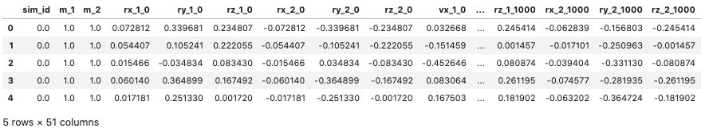

# Modeling the N-Body Problem with Machine Learning

The data provided by the simulation is the position and velocity of each body at each time step. To be used in a machine learning model, the data was restructured into having columns for each initial position and velocity paired with positions and velocity of some future time state.

For the models in this study, time horizons of 10, 100, and 1000 time steps were used.

Gradient boosting was used, with slightly optimized hyperparameters (via trial and error, grid search took too long) to model 2 and 3 body systems with different time horizons.

Here is a sample of what the data from a 2-body system would look like: 

<p align="center">

</p>

An example key for the data columns is as follows (and is consistent for all columns):

```
sim_id:     the arbitrary id of the simulation run
m_1:        mass of the first body
m_2:        mass of the second body
rx_1_0:     x position of the first body at time 0 (predictor)
vx_2_100:   y velocity of the second body at time 100 (target)
rz_2_1000:  z position of the second body at time 1000 (target)
```

The models were generated using this data structure by running the `model_generator.py` file. Some feature transformations were performed to reduce the dimensionality of the problem. The position and velocity of each body at each point in time are relative to the center of mass of that system. A system with a reference frame of one of the bodies would reduce the dimensionality. This is done by subtracting the position and velocity of the first body from the rest, essentially making the position and velocity of the first body 0 for all time. This reduced 6 columns of the data. The `transform.py` file provides functions for this reduction, and for inverse transformations back to the center of mass reference frame.

A multioutput regressor wrapper in sci-kit learn is used to force the gradient boosting regressor to provide as many outputs in the prediction as inputs, so the state of the system at a later time is predicted.

The 6 final models are pickled and stored on an AWS S3 bucket as they are too large for GitHub.
